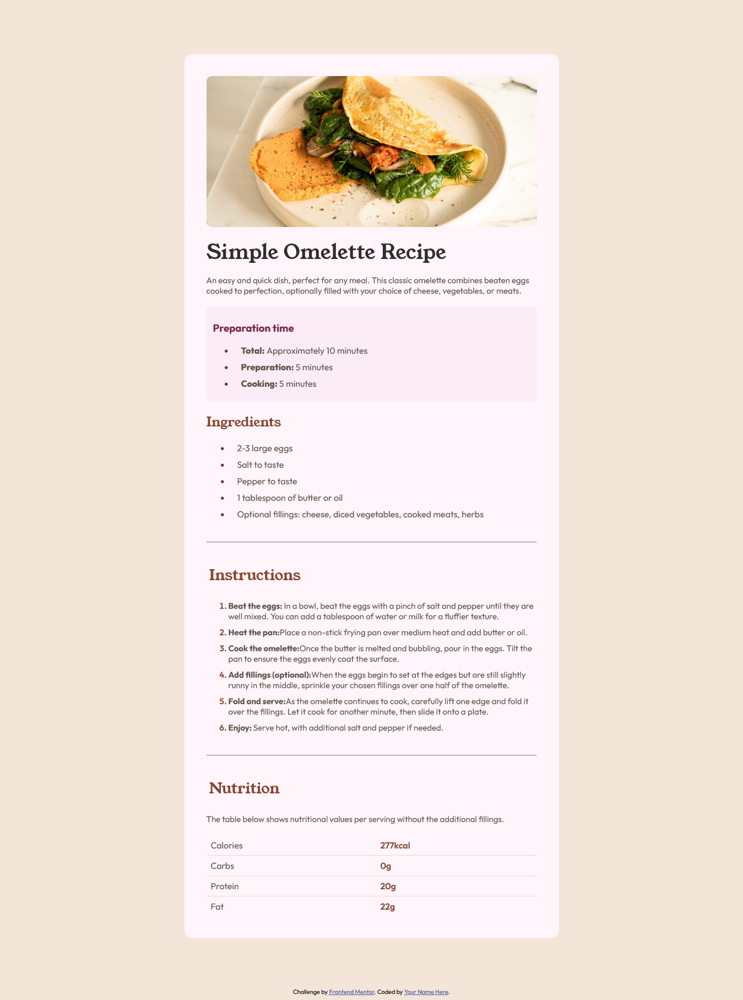

# Frontend Mentor - Recipe page

Frontend Mentor Recipe page

## Table of contents

- [Overview](#overview)
  - [Screenshot](#screenshot)
  - [Links](#links)
- [My process](#my-process)
  - [Built with](#built-with)
  - [What I learned](#what-i-learned)
  - [Continued development](#continued-development)
  - [Useful resources](#useful-resources)
- [Author](#author)
- [Acknowledgments](#acknowledgments)

## Overview

### Screenshot



### Links

- Solution URL: [https://github.com/Konamti/konamti.github.io.git]
- Live Site URL: [https://konamti.github.io/]

## My process

### Built with

- Semantic HTML5 markup
- CSS custom properties
- Flexbox

### What I learned

I learnt a new property I had difficulty understanding for time in CSS. I also learnt how insert attribution.

```css
td:nth-child(odd) {
  color: var(--Stone600);
}
td:nth-child(even) {
  color: var(--Brown800);
  font-weight: 600;
}

tr:last-child td {
  border-bottom: none;
}

ul li::marker {
  color: var(--Rose800);
}
```

### Continued development

I would like to improve my CSS responsive skills alot and flexbox properties. I would love to reinforce my knowledge on flexbox and other related properties.

### Useful resources

N/A

## Author

- Frontend Mentor - [@konamti](https://www.frontendmentor.io/profile/konamti)

## Acknowledgments

Huxn Webdev, on youtube. I followed his tutorials and it helped me alot in my coding journey.
